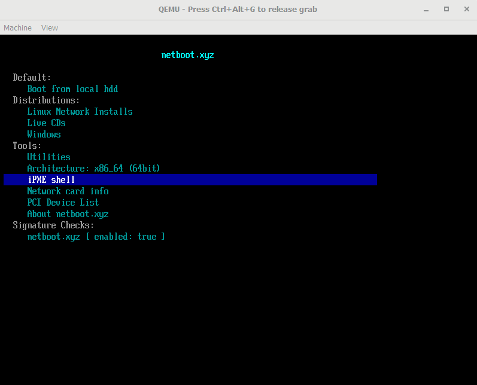

PXE Boot for Slim Bootloader
============================
This repo demonstrates how to support network boot on [Slim Bootloader](https://github.com/slimbootloader) through a customized payload. It utilizes [netbootxyz](https://netboot.xyz) and a minimalized EDK2 [UEFI payload](https://github.com/tianocore/edk2) to provide the PXE boot capability.

Overview
---------
EDK2 UEFI payload can support network boot natively through the UEFI network stack. But it needs to integrate additional network stack drivers and UNDI driver. On the other side, open source [iPXE](https://ipxe.org) project provides an alternative path to support network boot on top of UEFI.  And [netbootxyz](https://netboot.xyz) project extends it further to support booting most of the popular Linux Live ISO images through network. This project demonstrates how to take the advantage of netbootzyz and UEFI payload to implement PXE boot with Slim Bootloader on QEMU platform. The similar can be applied on other real [platforms](https://slimbootloader.github.io/supported-hardware/index.html) supported by Slim Bootloader.

Build Steps:
------------
- Clone this repo into directory %NETBOOT%

- Clone Slim Bootloader repo into directory %SLIMBOOT%

- Switch to %NETBOOT% directory and build UEFI payload with netbootxyz as default boot option::

    python BuildNetboot.py build -r

- Copy generated UEFI payload into Slim Bootloader (The path might need adjustment according to your build toolchain)::

    copy %NETBOOT%\Edk2\Build\UefiPayloadPkgX64\RELEASE_VS2019\Fv\UEFIPAYLOAD.fd
     %SLIMBOOT%\PayloadPkg\PayloadBins\UefiPldNetBoot.fd

- Switch to %SLIMBOOT% directory and build Slim Bootloader with this customized UEFI payload::

    python BuildLoader.py build qemu -p OsLoader.efi:LLDR:Lz4;UefiPldNetBoot.fd:UEFI:Lzma

- Boot QEMU::

    "C:\Program Files\qemu\qemu-system-x86_64.exe" -m 256M -cpu max -machine q35,accel=tcg
    -drive if=pflash,format=raw,file= %SLIMBOOT%\Outputs\qemu\SlimBootloader.bin
    -drive id=mydisk,if=none,file=fat:rw:Disk,if=none,format=raw
    -device ide-hd,drive=mydisk -boot order=dba -serial stdio

- Screenshot

  

The steps above used QEMU platform as an example for convenience. However, the exact same
UefiPldNetBoot.fd can work on many real platforms as well, such as APL LeafHill board,
WHL Up Xtreme board, etc.
